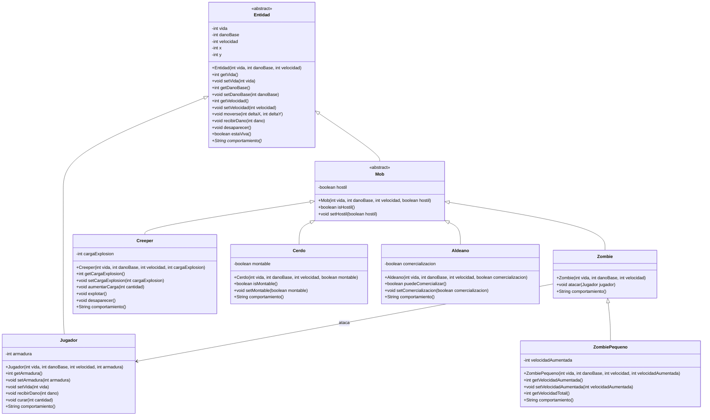

# sgomezdelafuente-talle-git-2026

Nombre: Sebastian Gomez de la Fuente
Usuario GitHub: SGDFM
Comision: CYT646 F

## Como levantar la API

```bash
./mvnw spring-boot:run
```

## Endpoints principales

- `GET /`: estado basico de la API.
- `GET /minecraft/sgomezdelafuente/comportamientos?vida=20&velocidad=2&cargaExplosion=3&comercializacion=true`: construye dos entidades y devuelve su comportamiento usando el tipo padre `Entidad`.
- `GET /minecraft/sgomezdelafuente/creeper`: estado del creeper.
- `GET /minecraft/sgomezdelafuente/jugador`: estado del jugador.

## Diagrama de clases


